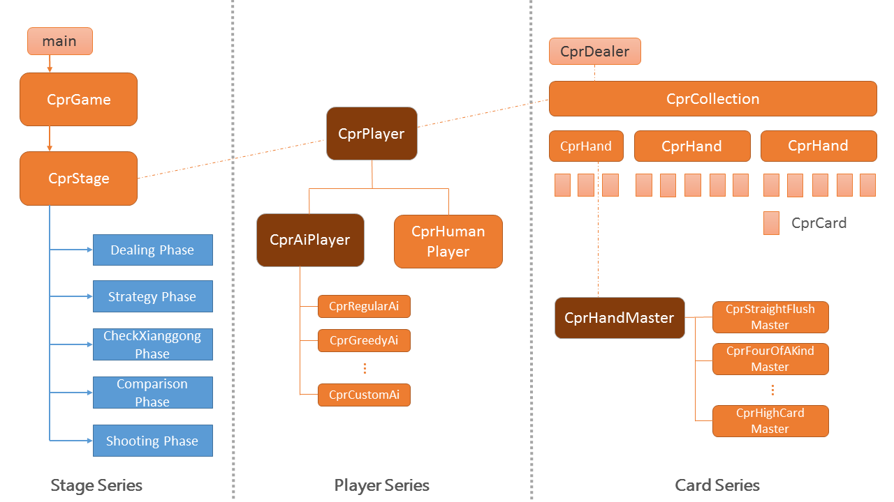

# Chinese Poker (十三支)

This project is a c++ implementation of a traditional Chiense Poker Game (十三支).
It was designed as the semester project of Computer Programming course for NTU students in 2016-2017.

The realtionship between each class is illustrated as the following figure.

In each weekly coding session, students were instructed elaborately in implementing each specific part.

Please feel free to contact [me](mailto:hiiwave@gmail.com) if you'd like to know more about this project.